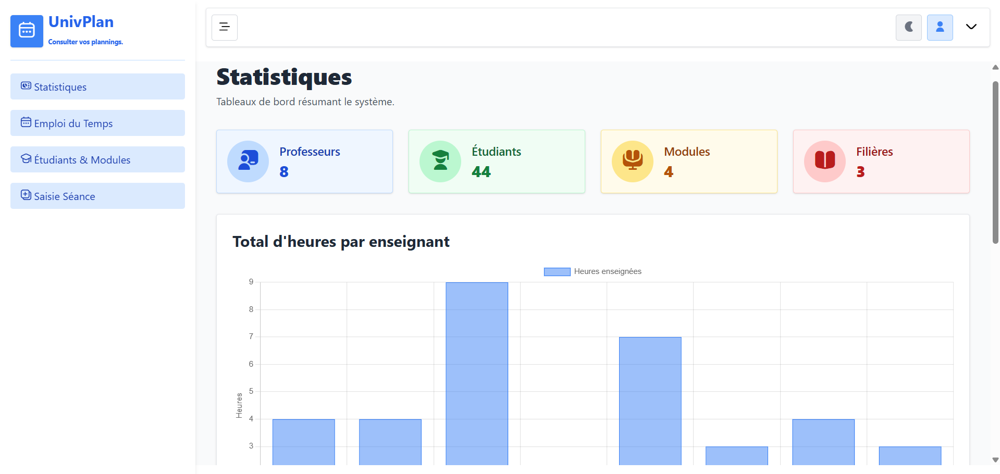

# 📘 UnivPlan – Gestion Dynamique d’Emploi du Temps Universitaire

> 🚠 Projet académique en cours de construction  
> 🔧 Technologies : `XML`, `AJAX`, `PHP`, `XSLT`, `Chart.js`, `TailwindCSS`

---

## 🚀 À propos

**UnivPlan** est une application web dynamique permettant :

- 🗓️ La **visualisation structurée d’un emploi du temps** universitaire depuis un backend relationnel.
- 👩‍🎓 La **consultation des étudiants et des modules** par classe.
- ✍️ La **saisie asynchrone de nouvelles séances** (cours) via un formulaire AJAX.
- 📊 La **génération de graphiques statistiques interactifs** (ex : heures par professeur).
- 🔁 L’utilisation d’un **moteur XSLT** pour transformer des données XML en HTML stylisé.
- 🧭 Une **intégration dans un Dashboard unifié** rassemblant emploi du temps, statistiques et saisie dynamique.

> 🌟 **Objectif personnel** : se forger une expertise concrète autour de **XML** et **AJAX**, des technologies fondamentales dans la communication client–serveur.

---

## 🪛 Stack technique

| Côté Client               | Côté Serveur     | Base de Données  | Transformation                        |
|--------------------------|------------------|------------------|----------------------------------------|
| HTML5 + TailwindCSS      | PHP (XAMPP)      | MySQL (PDO)      | XML + XSLT (DOMParser, XSLTProcessor)  |
| JavaScript (AJAX, Fetch) | Chart.js         |                  |                                        |

---

## 📂 Fonctionnalités

- Affichage des emplois du temps par classe depuis XML.
- Consultation des étudiants et modules avec transformation XSLT.
- Graphiques statistiques dynamiques avec Chart.js.
- Saisie de nouvelles séances via formulaire AJAX.
- Mise à jour automatique du XML et de la base.
- Interface responsive avec **TailwindCSS**.
- Dashboard centralisé pour tout gérer depuis une seule page.

---

## 🧠 Enjeux pédagogiques

Ce projet m’a permis d’ancrer les compétences suivantes :

- 🧬 Manipulation des **flux XML/XSL côté frontend** (`DOMParser`, `XSLTProcessor`).
- 🔌 Conception d’**API PHP orientées données structurées** (XML & JSON).
- 🧪 Maîtrise d’**AJAX natif** et de la **Fetch API**.
- 🎨 Intégration propre et responsive avec **Tailwind CSS**.
- 📦 Création d’un **Dashboard unifié** pour centraliser toutes les interactions.

---

## 🖼️ Aperçu



---

## ⚙️ Installation

```bash
# Cloner le projet dans htdocs
git clone https://github.com/ibraum/univplan.git
